# Unicode 女书输入法

**使用 Unicode 女书输入法，简便地输入 Unicode 编码的 396 个女书字符。**

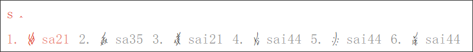

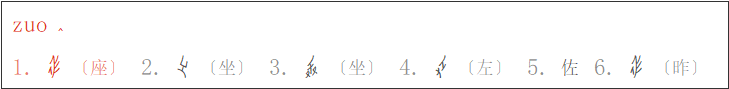

| Unicode 女书输入法必要文件 | 最新版本 |
| :- | :- |
| unicode_nushu_romanization.dict.yaml | 20180506 V1.1.04 |
| unicode_nushu_romanization.schema.yaml | 20180506 V1.0.03 |
| luna_pinyin_nushu.schema.yaml | 20180506 V1.0.01 |
| s2nushu.json | 20180506 |
| s2nushu.txt | 20180528  |

## 安装方法

　　安装 Unicode 女书输入法有三大步骤：（1）安装 RIME；（2）下载必要字体；（3）在 RIME 中配置 Unicode 女书输入方案。

### 安装 RIME

　　RIME 在 Windows 操作系统上称为「小狼毫」。若您使用的是 Windows 操作系统，请在 http://rime.im/download/ 下载小狼毫输入法的安装包。

### 安装天珩全字库

　　打开[天珩全字库](http://cheonhyeong.com/Simplified/download.html)网页，选择第一项 `天珩全字库V2.1.0(TH-Tshyn)` 下载。

　　下载的文件是一个压缩文件，将它解压，会出现 `TH-Tshyn-P0.ttf`，`TH-Tshyn-P1.ttf` 与 `TH-Tshyn-P2.ttf` 三个字体文件。能显示女书的字体为 `TH-Tshyn-P1.ttf`，因此 Unicode 女书只需要这一个文件就可以正常工作。

　　若使用 Windows 操作系统，在 `TH-Tshyn-P1.ttf` 上点击右键，选择「安装」，即可安装天珩全字库。

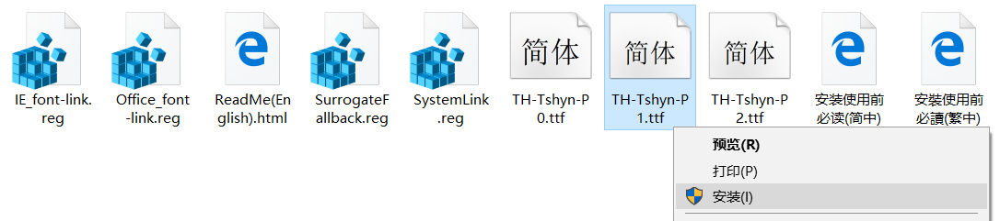

> 注意：天珩全字库属于非盈利的、学习研究型的字库，目的是汉字的显示，不制作或出售任何商业作品。字形版权：中易、华康、Iwata、Besta、方正。字库中字体的字形均为上述公司制作，非本软件作者制作。字库的字体属于已经公开的字体，故字库仅仅起到收集整理的作用，方便用户使用。作者并未对字体做出任何有意义的改动，若有任何人以字库的名义收取任何费用，字库作者不承担任何连带责任。

### 在小狼毫中配置 Unicode 女书输入方案

#### 一、下载并放置必要文件

　　[点击此处下载 Unicode 女书输入法必要文件](./UnicodeNushu.zip)。

　　下载的文件是一个压缩文件，将它解压，找到以下五个文件，放置到指定位置：

| Unicode 女书输入法文件 | 在小狼毫输入法中的文件放置位置 |
| :- | :- |
| unicode_nushu_romanization.dict.yaml | 【小狼毫】用戶文件夾/ |
| unicode_nushu_romanization.schema.yaml | 【小狼毫】用戶文件夾/ |
| luna_pinyin_nushu.schema.yaml | 【小狼毫】用戶文件夾/ |
| s2nushu.json | 【小狼毫】程序文件夾/data/opencc/ |
| s2nushu.txt | 【小狼毫】程序文件夾/data/opencc/ |

　　要打开【小狼毫】用户文件夹，需要在「开始菜单」中点击「小狼毫輸入法」->「【小狼毫】用戶文件夾」；

　　要打开【小狼毫】程序文件夹，需要在「开始菜单」中点击「小狼毫輸入法」->「【小狼毫】程序文件夾」。

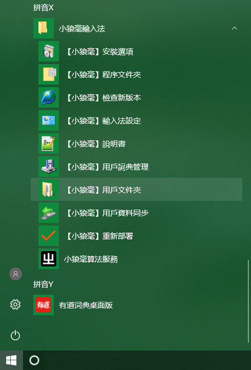

#### 二、启用输入方案

　　回到「开始菜单」，点击「【小狼毫】輸入法設定」。

　　在弹出的方案选单中找到「朙月拼音·Unicode 女书」和「Unicode 女书拼音」**两项**，并勾选，点击「中」。

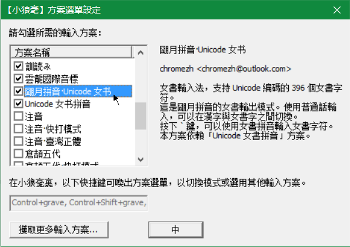

　　待部署完成后，按 `F4` 或 ```Ctrl+` ``` 唤出菜单，选择「朙月拼音·Unicode 女书」，即可使用 Unicode 女书输入法。

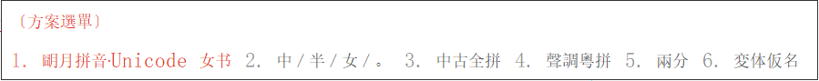

#### 三、使用效果

　　新建一个文档，使用 Unicode 女书输入法输入一个女书字符。

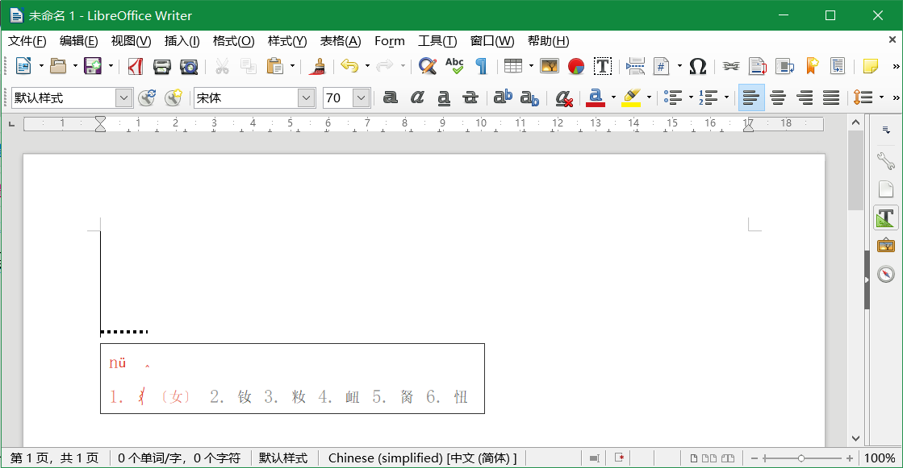

　　如果没有切换字体，字符可能不能正确显示。此时在字体栏中选择 `TH-Tshyn-P1` 即可。

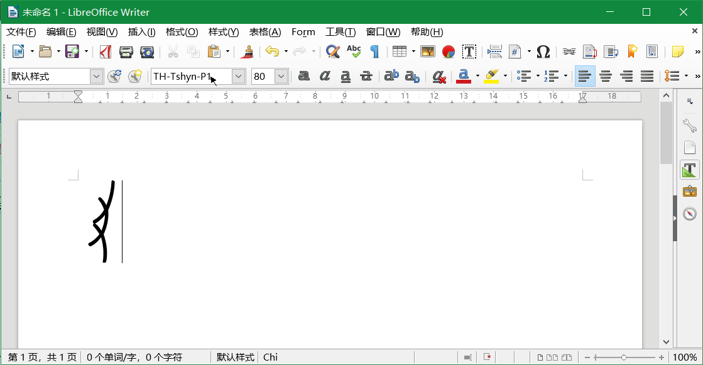

## Unicode 女书输入法更新

　　Unicode 女书输入法的当前版本有 5 个必要文件，在本页面的开头可以看到它们的版本信息。若 Unicode 女书输入法的文件发生变化，或 5 个必要文件的版本号发生变化，说明输入法有更新。

　　下面对 Windows 操作系统的小狼毫输入法的更新方法进行说明。

**若使用的是 20180505 及更早的版本：**

　　**首先，删除原版本的文件：**

* 在「开始菜单」中点击「小狼毫輸入法」->「【小狼毫】輸入法設定」
* 找到旧版本的「Unicode 女书」，取消前面的勾选

  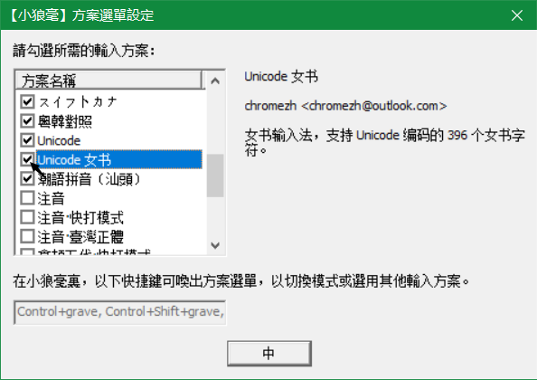

* 在「开始菜单」中点击「小狼毫輸入法」->「【小狼毫】用戶文件夾」，打开用户文件夹，将 `unicode_nushu.dict.yaml` 和 `unicode_nushu.schema.yaml` 两个文件删除

　　**再下载新的文件：**

* 按「[安装方法](/unicode_nushu/install)」中所述方法，从本 GitHub 仓库下载最新的 Unicode 女书输入法文件
* 按「[安装方法](/unicode_nushu/install)」中所述方法，重新配置 Unicode 女书输入方案

> 注：在本输入法的 20180505 及以前版本中，由于功能较少，只有 2 个必要文件：`unicode_nushu.dict.yaml` 和 `unicode_nushu.schema.yaml`，在目前的版本中已经不需要这两个文件，因此，需要首先将它们删除，再加入新的文件。

**若使用的是较新的版本，与最新版本的区别只有版本号不同：**

* 按上节所述方法，从本 GitHub 仓库下载最新的 Unicode 女书输入法文件
* 用新版本号的文件替换原有旧版本号的文件
* 在「开始菜单」中点击「小狼毫輸入法」->「【小狼毫】重新部署」

## 使用方法

### 使用普通话拼音输入女书（汉字对照）

　　首先，将输入法切换到「小狼毫（TSF）」。

　　按 `F4` 或 ```Ctrl+` ``` 唤出菜单，选择「朙月拼音·Unicode 女书」，即可通过普通话输入女书。

　　目前支持 1760 个汉字，其他汉字尚不能转换为对应的女书。


### 使用女书拼音输入女书

　　首先，将输入法切换到「小狼毫（TSF）」。

　　按 `F4` 或 ```Ctrl+` ``` 唤出菜单，选择「朙月拼音·Unicode 女书」。

　　按下 &#96; 键（在键盘的左上角）， 进入女书拼音输入模式。

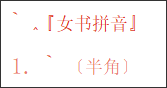

　　继续输入字母，即可通过女书拼音输入女书。


　　另外，按 `F4` 或 ```Ctrl+` ``` 唤出菜单，选择「Unicode 女书拼音」，可以在不按 &#96; 键的情况下，通过女书拼音输入女书。

### 退出女书输入模式（只得到汉字）

　　使用「朙月拼音·Unicode 女书」时，有两种方法退出女书模式。退出女书输入模式后，仍然是使用普通话拼音进行输入，但得到的是汉字，而不是女书。

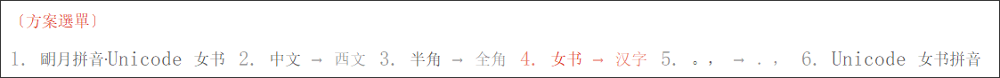

　　可以按 `F4` 或 ```Ctrl+` ``` 唤出菜单，再按 4 选择「女书 -> 汉字」选项退出女书模式，也可以按 `Ctrl+Shift+4` 快捷键退出女书模式。


## 女书拼音

> 注：此处的女书拼音不是完整的江永城关话音系，仅是为了输入女书字符而设定。

### 声母

| 国际音标 | p | p' | m | f | v | t | t' | n | l | ts | ts' | s | tɕ | tɕ' | ȵ | k | k' | ŋ | h | ∅ |
| :-: | :-: | :-: | :-: | :-: | :-: | :-: | :-: | :-: | :-: | :-: | :-: | :-: | :-: | :-: | :-: | :-: | :-: | :-: | :-: | :-: |
| NushuSources | p | ph | m | f | v | t | th | n | l | ts | tsh | s | tc | tch | nj | k | kh | ng | h | &nbsp; |
| Unicode 女书输入法拼音 | b | p | m | f | v | d | t | n | l | z | c | s | j | q | nj | g | k | ng | h | &nbsp; |

> 说明：Unicode 女书输入法的声母表记类似普通话拼音方案。

### 韵母

| 国际音标 | a | ua | ya | ie | ø | uø | yø | uə | yə | ɯə | i | iu | u | yu | y | ɯ | ai | uai | yai | au | iau | ou | iou | əɯ | uoɯ | yoɯ | uɯ | yn | aŋ | iaŋ | uaŋ | yaŋ | əŋ | oŋ | ioŋ | iŋ | ŋ |
| :-: | :-: | :-: | :-: | :-: | :-: | :-: | :-: | :-: | :-: | :-: | :-: | :-: | :-: | :-: | :-: | :-: | :-: | :-: | :-: | :-: | :-: | :-: | :-: | :-: | :-: | :-: | :-: | :-: | :-: | :-: | :-: | :-: | :-: | :-: | :-: | :-: | :-: |
| NushuSources 及 Unicode 女书输入法拼音 | a | ua | ya | ie | oe | uoe | yoe | ue | ye | we | i | iu | u | yu | y | w | ai | uai | yai | au | iau | ou | iou | ew | uow | yow | uw | yn | ang | iang | uang | yang | eng | ong | iong | ing | ng |

> 注意：
> 1. `y` 代表普通话拼音中 `ü` 的发音；
> 1. `w` 代表不圆唇的 `u`；
> 1. `ue`, `ye`, `we` 中的 `e` 读如普通话「饿」，不是普通话「夜」（ye）中的 `e`。

### 声调

　　声调 7 个，其中平上去分阴阳，入声不分。

　　调值：阴平 **44** 阳平 **42** 阴上 **35** 阳上 **13** 阴去 **21** 阳去 **33** 入声 **5**。

　　其中，声调使用「五度标调法」表示，数字表示的是声调的调值，即将音高分为 5 度，最高为 `5`，最低为 `1`。例如 `35` 表示升调，且音高由中等到最高。入声读音短促，故用单数字表示。

## Unicode 编码-女书发音对照表

　　本表修订于 2018 年 5 月 6 日。

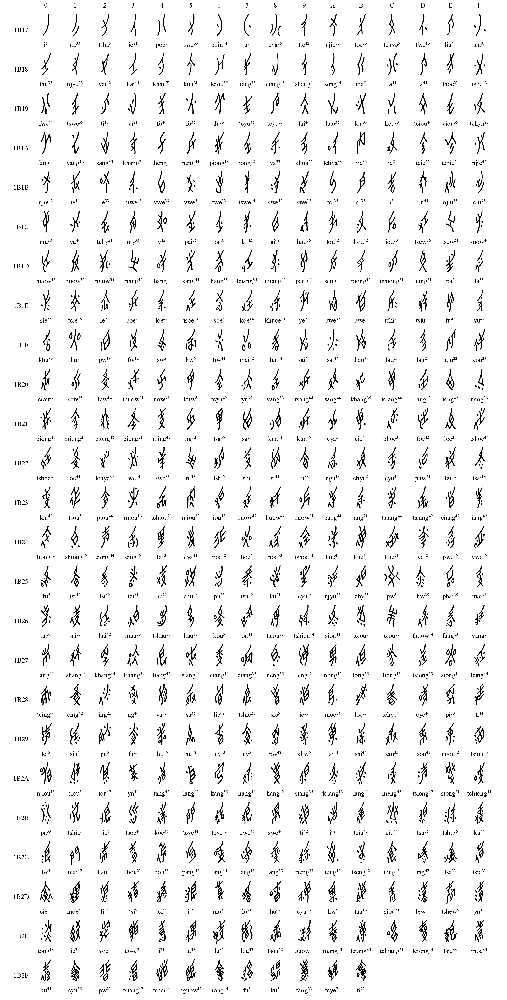

## 致谢

　　本项目利用了以下项目的成果：

* [RIME &brvbar; 中州韻輸入法引擎](http://rime.im/)
* [開放中文轉換 (Open Chinese Convert)](https://github.com/BYVoid/OpenCC)
* [天珩全字库](http://cheonhyeong.com/Simplified/download.html)

　　本项目参考了以下资料：

* 赵丽明，徐焰著《女书规范字书法字帖》
* **Unicode Character Database** 中的 [NushuSources-11.0.0d1.txt](http://www.unicode.org/Public/11.0.0/ucd/NushuSources-11.0.0d1.txt)

## 开发指南

　　欢迎更多的人参与到 Unicode 女书输入法的开发中，为本项目的完善贡献力量。

### Unicode

　　[Unicode](http://www.unicode.org/)（统一码、万国码、单一码）是计算机科学领域里的一项业界标准，包括字符集、编码方案等。Unicode 是为了解决传统的字符编码方案的局限而产生的，它为每种语言中的每个字符设定了统一并且唯一的二进制编码，以满足跨语言、跨平台进行文本转换、处理的要求。

　　Unicode 10.0 于 2017 年 6 月 20 日发布，其中加入了 396 个女书字符，编码区域为 U+1B170 - U+1B2FF。使得女书可以进行通用的计算机处理。

　　[http://www.unicode.org/charts/PDF/U1B170.pdf](http://www.unicode.org/charts/PDF/U1B170.pdf)

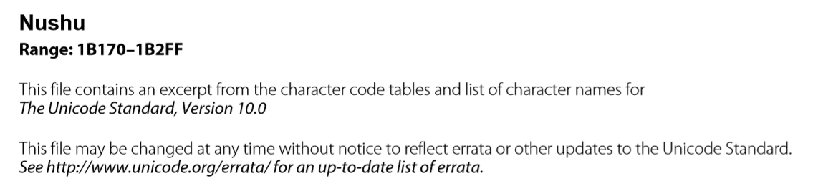

### 中州韵输入法引擎（RIME）

　　[RIME &#124; 中州韻輸入法引擎](http://rime.im/)（RIME）是一个优秀的开源输入法框架，它最卓越的特点是高度可配置，支持用户定制输入方案、码表、用户词典、按键行为、界面外观，因此受到了语言文字爱好者的欢迎。爱好者们基于 RIME 实现了包括双拼、方言在内的各种输入法。

　　RIME 可以在各种操作系统上使用，在 Windows 上称为「[小狼毫](https://github.com/rime/weasel)（Weasel）」，在 Linux 上有 [ibus-rime](https://github.com/rime/ibus-rime) 和 [fcitx-rime](https://github.com/fcitx/fcitx-rime)，在 macOS 上称为「[鼠须管](https://github.com/rime/squirrel)（Squirrel）」，在 Android 上称为「[同文输入法](https://github.com/osfans/trime)（trime）」，在 iOS 上称为 iRime。

　　若在使用 RIME 的过程中有任何疑问，可在 QQ 群 77608640 中询问。

### 开放中文转换（openCC）

　　[openCC](https://github.com/BYVoid/OpenCC) 是中文简繁转换开源项目，支持词汇级别的转换、异体字转换和地区习惯用词转换（中国大陆、台湾、香港）。

　　在本项目中，通过对 RIME 输入法中内置的 openCC 增加简体汉字到女书字符的转换（对应的文件为 `s2nushu.json` 与 `s2nushu.txt`），实现了输入普通话拼音，输出女书字符的效果。

### 天珩全字库

　　[天珩全字库](http://cheonhyeong.com/Simplified/download.html) V2.1.0(TH-Tshyn) 是目前字符数量最全的字体支持包，其中汉字部分支持大约 12 万，主要设计为大陆风格，扩展 EF 主要为日本风格。另外本字库有 Unicode 10.0 以内的几乎所有字符，包括表情符号（黑白色）。

　　天珩全字库中的字体 `TH-Tshyn-P1.ttf` 可以显示 Unicode 编码的女书字符。

　　有关天珩全字库的问题，可以在 QQ 群 436064726 中询问。
