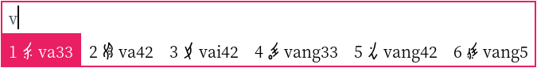

# 女书输入法 Nushu Input Method

**使用女书输入法，简便地输入 Unicode 编码的 396 个女书字符。<br/>Use the Nushu Input Method to easily input the 396 Nushu characters encoded in Unicode**

## 用法 Usage

使用江永方言拼音输入女书字<br/>Input Nushu by the romanization of Jiangyong dialect



使用汉语拼音（普通话）输入汉字对应的女书字<br/>Input Nushu by _pinyin_ (the romanization of _Putonghua_, standard Chinese)


## 安装方法 Installation

### Windows

**第一步：安装小狼毫输入法<br/>Step 1: Install the Weasel IME**

去这里安裝小狼毫輸入法 <https://rime.im/>。<br/>Install the Weasel IME from <https://rime.im/>.

**第二步：安装女书输入方案<br/>Step 2: Install the Nushu input schema**

- 用 <kbd>Win</kbd> + <kbd>space</kbd> 切换到小狼毫輸入法<br/>Click <kbd>Win</kbd> + <kbd>space</kbd> to switch to Weasel IME
- 右击「中」字，选择「输入法设定」<br/>Right click on the 中 symbol, and click 輸入法設定 (the first option)<br/>
- 点击「獲取更多輸入方案」<br/>Click 獲取更多輸入方案<br/>
- 在弹出的命令窗口中輸入 `nushu-script/rime-nushu`，然后按 <kbd>Enter</kbd><br/>Enter `nushu-script/rime-nushu` in the console popup window. Then press <kbd>Enter</kbd>

**第三步：启用女书输入方案<br/>Step 3: Enable the Nushu input schema**

- 关闭命令窗口，返回「輸入法設定」界面，勾选「女书」与「朙月拼音・女书」，然后点击「中」<br/>Close the console panel，return to the 輸入法設定 panel，and check 女书 and 朙月拼音・女书. Click 中 to apply the changes
- 选择自己喜欢的主题，再点击「中」完成设置<br/>Select your favorite theme, and click 中 to complete the setup<br/>
- 回到选单点击「重新部署」，等待程序处理词库数据<br/>Use the 重新部署 option in the option list to compile the installed schema libraries<br/>
- 按 <kbd>Ctrl</kbd> + <kbd>&#x60;</kbd>（注意是数字 1 左边的按键，不是单引号！），然后通过数字键选取「朙月拼音・女书」（你可能要按 <kbd>=</kbd> 翻页才会看到）<br/>Click <kbd>Ctrl</kbd> + <kbd>&#x60;</kbd> (grave, the key on the top left corner, not to be confused with single quote) and select 朙月拼音・女书 by the number keys (You may need to navigate to the next page with <kbd>=</kbd>)

### macOS

**第一步：安装鼠须管输入法<br/>Step 1: Install the Squirrel IME**

去这里安裝鼠须管輸入法 <https://rime.im/>。<br/>Install the Squirrel IME from <https://rime.im/>.

**第二步：安装女书输入方案<br/>Step 2: Install the Nushu input schema**

打开你的 terminal，复制粘贴运行以下命令。<br/>Open your terminal, and copy the following command to the terminal.

```sh
curl -fsSL https://git.io/rime-install | bash -s -- nushu-script/rime-nushu custom:set:config=default,key=installed_from,value=nushu-script/rime-nushu custom:add:schema=nushu custom:add:schema=luna_pinyin_nushu
```

其中可能弹出提示需要安装 git，要点击允许，否则无法下载女书输入方案。<br/>A prompt may appear if you have not installed git. git is required for the code to function properly.

如果你不知道如何打开 terminal，可以按 <kbd>Ctrl</kbd> + <kbd>Enter</kbd> 打开 spotlight，然后搜索 terminal。<br/>If you do not know how to open the terminal, you can press <kbd>Ctrl</kbd> + <kbd>Enter</kbd> to open spotlight and search for it.

**第三步：启用女书输入方案<br/>Step 3: Enable the Nushu input schema**

- 点击「重新部署」和「同步用户数据」，等待程序处理词库数据<br/>Click the 重新部署 and 同步用户数据 options in the option list to compile the installed schema libraries<br/>
- 按 <kbd>Ctrl</kbd> + <kbd>&#x60;</kbd>（注意是数字 1 左边的按键，不是单引号！），然后通过数字键选取「朙月拼音・女书」（你可能要按 <kbd>=</kbd> 翻页才会看到）<br/>Click <kbd>Ctrl</kbd> + <kbd>&#x60;</kbd> (grave, the key on the top left corner, not to be confused with single quote) and select 朙月拼音・女书 by the number keys (You may need to navigate to the next page with <kbd>=</kbd>)

### Arch Linux

**第一步：安装 fcitx5-rime 输入法<br/>Step 1: Install the fcitx5-rime IME**

使用以下命令安装：<br/>Install with the following command:

```sh
sudo pacman -S fcitx5 fcitx5-qt fcitx5-gtk fcitx5-rime kcm-fcitx5
```

新建配置文件 `~/.pam_environment`：<br/>Create the configuration file `~/.pam_environment`:

```
GTK_IM_MODULE DEFAULT=fcitx
QT_IM_MODULE  DEFAULT=fcitx
XMODIFIERS    DEFAULT=@im=fcitx
```

**第二步：安装女书输入方案<br/>Step 2: Install the Nushu input schema**

从 [AUR](https://aur.archlinux.org/packages/rime-nushu/) 安装女书输入方案。<br/>Install Nushu input schema from [AUR](https://aur.archlinux.org/packages/rime-nushu/).

**第三步：启用女书输入方案<br/>Step 3: Enable the Nushu input schema**

修改 `~/.local/share/fcitx5/rime/default.custom.yaml`：<br/>Modify `~/.local/share/fcitx5/rime/default.custom.yaml`:

```yaml
patch:
  schema_list:
    - schema: nushu
    - schema: luna_pinyin_nushu
```

然后重新部署 rime。<br/>Then redeploy rime.
